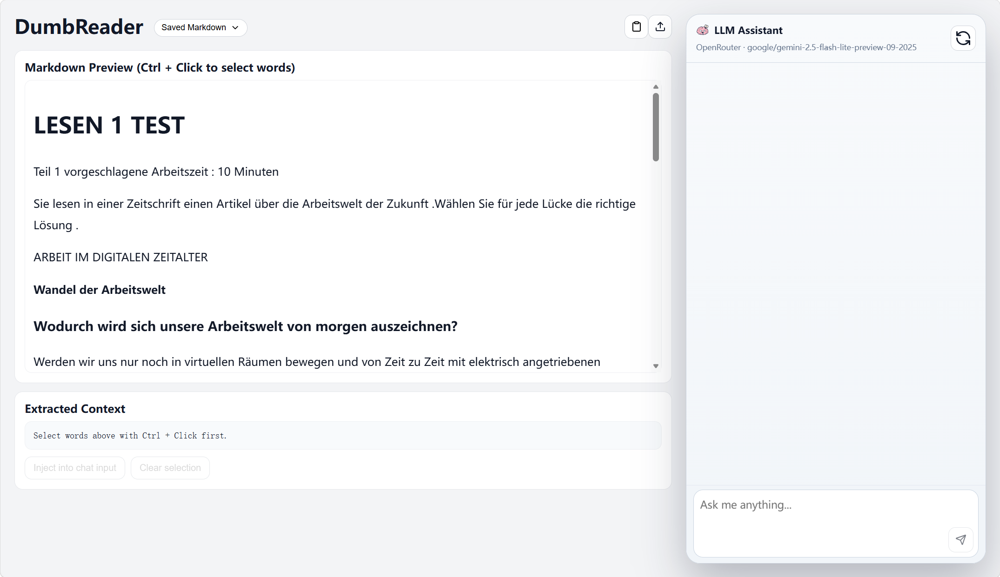

# DumbReader

DumbReader is a reading-assistant frontend project built with React + Vite.

## Preview

### Logo


### Screenshot



## Features

- **Image to Markdown**: upload one or multiple reading screenshots and convert them into structured Markdown.
- **Text to Markdown**: paste messy text and let the assistant reorganize it into cleaner Markdown.
- **Interactive Reading**: Ctrl + Click words in the preview to collect context and build focused learning prompts.
- **Built-in Assistant Chat**: send selected context directly to the chat panel for quick explanation and follow-up questions.
- **History Management**: save parsed Markdown locally, reopen previous files, and delete old entries when needed.

## Requirements

- Node.js 18+ (LTS recommended)
- npm (usually installed with Node.js)

## Quick Start (Recommended)

In the project root, double-click:

`start-smartreader.bat`

The script will automatically:

- Check whether npm is installed
- Run `npm install` when dependencies are missing
- Start the development server with `npm run dev`

## Manual Start

```bash
npm install
npm run dev
```

## Common Issues

- `npm not found`: install Node.js first, then restart the terminal
- First startup may be slow: dependencies are being installed

## License

- This project is licensed under `AGPL-3.0-or-later`. See `LICENSE`.
- If you modify and deploy this project as a network service, AGPL requires making the corresponding source available to users.
- Third-party dependency notices are documented in `THIRD_PARTY_NOTICES.md`.
- To refresh the dependency license inventory:

```bash
npm run licenses:summary
npm run licenses:report
```

